---
## Front matter
lang: ru-RU
title: Основы информационной безопасности 
subtitle: Лабораторная работа № 2. Дискреционное разграничение прав в Linux. Основы атрибуты
author:
  - Абдеррахим Мугари.
institute:
  - Российский университет дружбы народов, Москва, Россия
  
date: 28 февраля 2024ю

## i18n babel
babel-lang: russian
babel-otherlangs: english

## Formatting pdf
toc: false
toc-title: Содержание
slide_level: 2
aspectratio: 169
section-titles: true
theme: metropolis
header-includes:
 - \metroset{progressbar=frametitle,sectionpage=progressbar,numbering=fraction}
 - '\makeatletter'
 - '\beamer@ignorenonframefalse'
 - '\makeatother'
 
---

# Информация

## Докладчик

:::::::::::::: {.columns align=center}
::: {.column width="70%"}

  * Абдеррахим Мугари
  * Студент
  * Российский университет дружбы народов
  * [1032215692@pfur.ru](mailto:1032215692@pfur.ru)
  * <https://github.com/iragoum>

:::
::: {.column width="30%"}

:::
::::::::::::::

## Цель работы:

- Получение практических навыков работы в консоли с атрибутами файлов, закрепление теоретических основ дискреционного разграничения доступа в современных системах с открытым кодом на базе ОС Linux.

## Материалы и методы

- Терминал Unix

# Ход работы: 

## создание гостевой учетной записи и ее настройка

- Здесь мы создали учетную запись гостевого пользователя, используя нашу учетную запись администратора, используя команду **user addguest**, а затем мы установили пароль для гостевого пользователя, используя команду **password guest**.

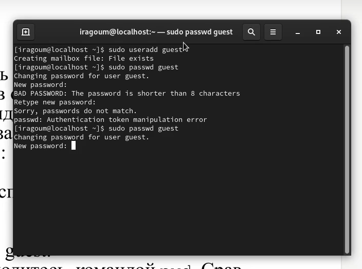{width=40%}

## вход в гостевую учетную запись

- Затем мы вошли в систему как гостевой пользователь, используя команду **su guest** .

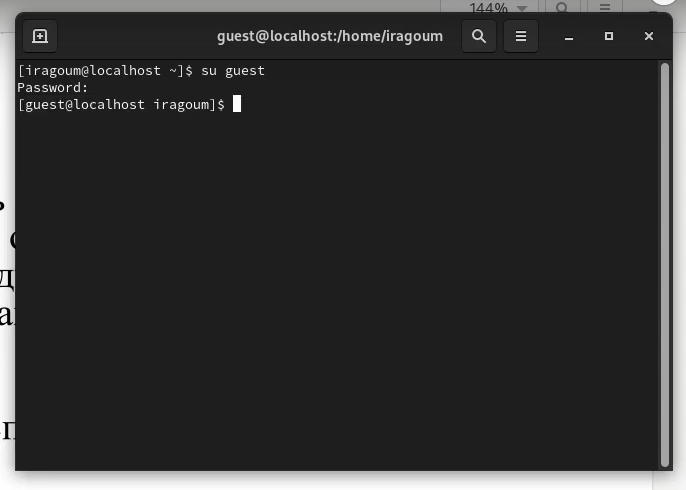{width=40%}

## определяя путь, по которому мы находились, и учетную запись пользователя, которую мы использовали

- Здесь мы определили каталог, в котором мы находились, с помощью команды **pwd**. После сравнения мы обнаружили, что мы не были расположены в домашнем каталоге гостя, и нам пришлось перейти к нему, после чего мы использовали команду **whoami** для определения учетной записи пользователя, в которую мы вошлири.

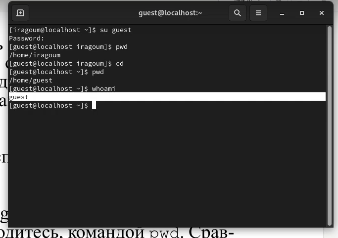{width=40%}

## указание имени пользователя, его группы, а также групп, в которые входит пользователь

- здесь мы указали имя нашего пользователя, его группу, а также группы, в которые входит пользователь, с помощью команды **id**.

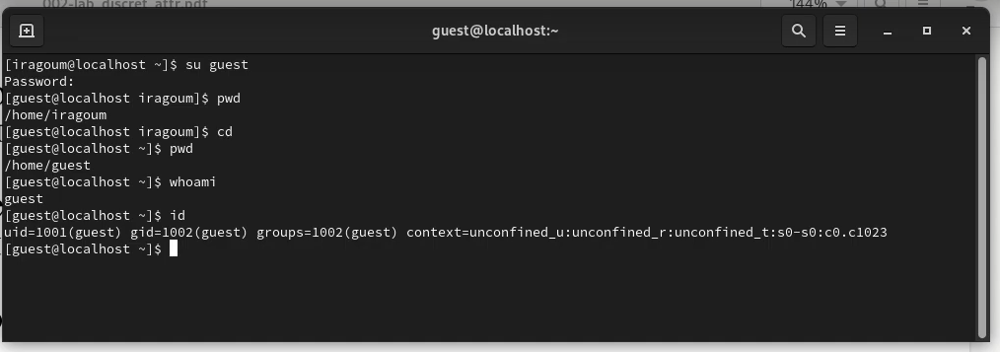{ width=40%}

- мы обнаружили, что данные идентичны.

## сравнение данных гостя в файле passwd

- затем мы прочитали файл */etc/passwd*, используя команду cat, и после этого, используя команду **cat /etc/passwd | grep guest**, мы выделили все слова, содержащие слово guest, мы нашли те же данные, которые получили ранее

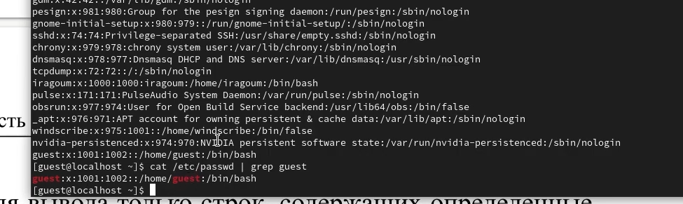{width=40%}

## идентификация существующих каталогов

- Затем мы определили существующие каталоги в системе с помощью команды **ls -l /home/**.

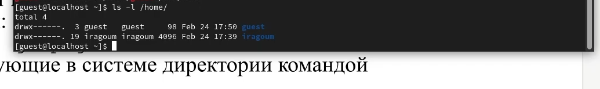{width=70%}

- да, мы смогли получить существующие подкаталоги каталога */home*, у них права **d(drwx)**

## проверка расширенных атрибутов

- затем мы проверили, какие расширенные атрибуты установлены в подкаталогах, расположенных в каталоге /home, с помощью команды: **lsattr /home** и обнаружили, что у них нет расширенных атрибутов.

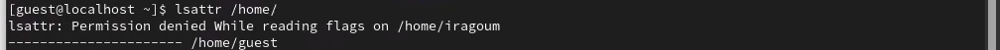{ width=100%}

## создание каталога dir1

- здесь мы создали каталог dir1, используя команду **mkdir**.

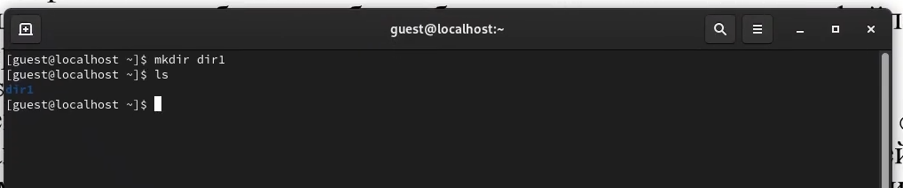{width=70%}

## определение прав доступа ирасширенных атрибутов каталога dir1

- Используя команды **ls -l** и **lsattr**, мы определили, какие права доступа и расширенные атрибуты были установлены для каталога *dir1*.

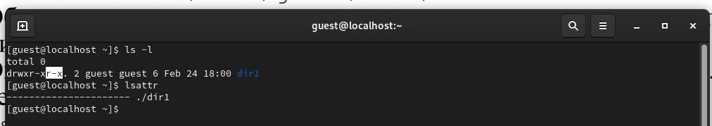{width=100%}

## удаление прав на каталог dir1

- затем мы удалили все атрибуты из каталога *dir1* командой **chmod 000 dir1**.

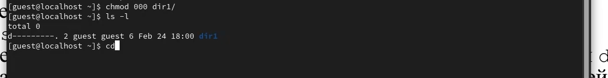{width=100%}

## создание file1 внутри каталога dir1

- здесь мы попытались создать файл file 1 в каталоге dir1 с помощью команды **echo "test" > /home/guest/dir1/file1** , но у нас не было разрешения на это, потому что у нас нет прав в каталог *dir1*

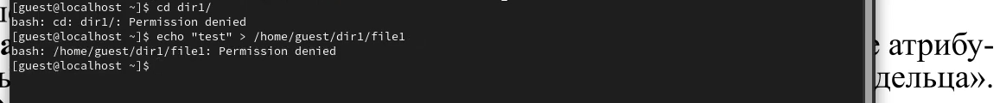{width=100%}

- нет, *file1* не находится внутри каталога *dir1*, потому что он даже не был создан.

## Заполнение таблицы установленных прав и разрешенных действий

- здесь мы приступили к заполнению таблицы "Установленные права и разрешенные действия" (см. таблицу 2.1), выполняя действия от имени владельца каталога.

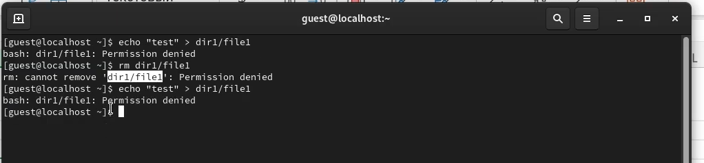{width=70%}

## Заполнение таблицы установленных прав и разрешенных действий

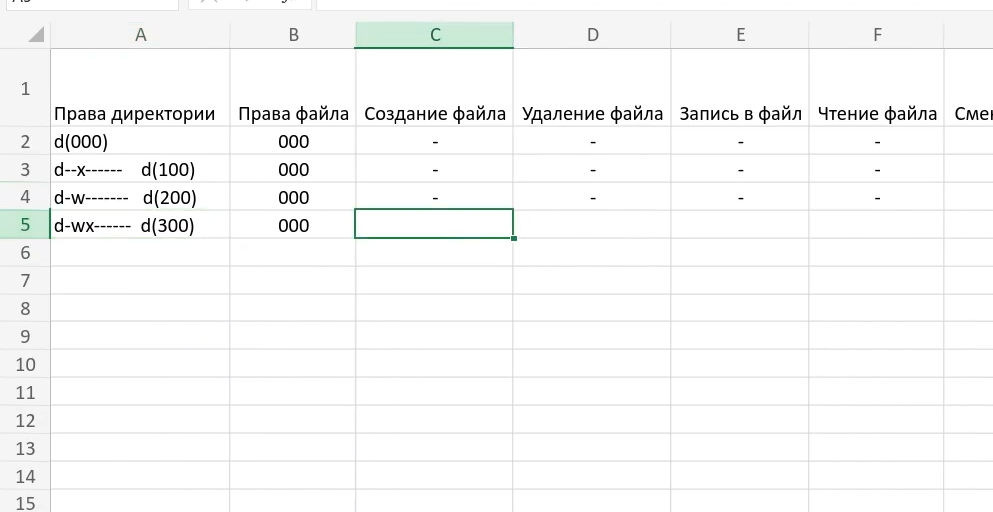{width=70%}

## таблица минимально необходимых прав для выполнения операций внутри каталога

- основываясь на заполненной таблице, мы смогли определить определенные минимально необходимые права для выполнения операций внутри каталога dir1, заполнив таблицу 2.2.

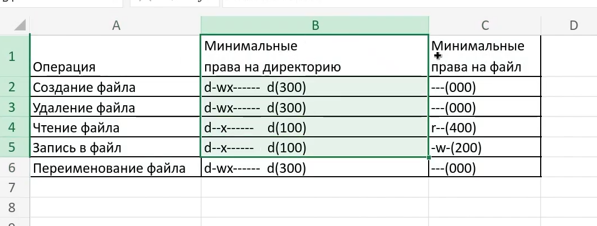{width=70%}

  
  
# Выводы, согласованные с целью работы:

- В рамках данной лабораторной работы мы получили практические навыки работы с атрибутами файлов в консоли Linux, а также закрепили теоретические основы дискреционного разграничения доступа.

