---
## Front matter
title: "Основы информационной безопасности | Дискреционное разграничение прав в Linux "
subtitle: "Лабораторная работа № 2. Основы атрибуты"
author: "Мугари Абдеррахим - НКАбд-03-22"

## Generic otions
lang: ru-RU
toc-title: "Содержание"

## Bibliography
bibliography: bib/cite.bib
csl: pandoc/csl/gost-r-7-0-5-2008-numeric.csl

## Pdf output format
toc: true # Table of contents
toc-depth: 2
lof: true # List of figures
lot: true # List of tables
fontsize: 12pt
linestretch: 1.5
papersize: a4
documentclass: scrreprt
## I18n polyglossia
polyglossia-lang:
  name: russian
  options:
	- spelling=modern
	- babelshorthands=true
polyglossia-otherlangs:
  name: english
## I18n babel
babel-lang: russian
babel-otherlangs: english
## Fonts
mainfont: PT Serif
romanfont: PT Serif
sansfont: PT Sans
monofont: PT Mono
mainfontoptions: Ligatures=TeX
romanfontoptions: Ligatures=TeX
sansfontoptions: Ligatures=TeX,Scale=MatchLowercase
monofontoptions: Scale=MatchLowercase,Scale=0.9
## Biblatex
biblatex: true
biblio-style: "gost-numeric"
biblatexoptions:
  - parentracker=true
  - backend=biber
  - hyperref=auto
  - language=auto
  - autolang=other*
  - citestyle=gost-numeric
## Pandoc-crossref LaTeX customization
figureTitle: "Рис."
tableTitle: "Таблица"
listingTitle: "Листинг"
lofTitle: "Список иллюстраций"
lotTitle: "Список таблиц"
lolTitle: "Листинги"
## Misc options
indent: true
header-includes:
  - \usepackage{indentfirst}
  - \usepackage{float} # keep figures where there are in the text
  - \floatplacement{figure}{H} # keep figures where there are in the text
---

# Цель работы

- Получение практических навыков работы в консоли с атрибутами файлов, закрепление теоретических основ дискреционного разграничения доступа в современных системах с открытым кодом на базе ОС Linux.

# Выполнение лабораторной работы

1. Здесь мы создали учетную запись гостевого пользователя, используя нашу учетную запись администратора, используя команду **user addguest**, а затем мы установили пароль для гостевого пользователя, используя команду **password guest** (рис. @fig:001).

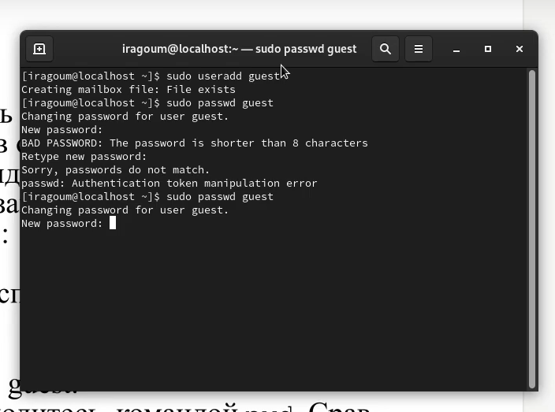{#fig:001 width=70%}

2. Затем мы вошли в систему как гостевой пользователь, используя команду **su guest** (рис. @fig:002).

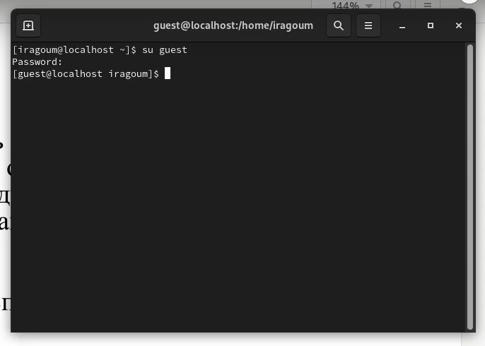{#fig:002 width=70%}

3. Здесь мы определили каталог, в котором мы находились, с помощью команды **pwd**. После сравнения мы обнаружили, что мы не были расположены в домашнем каталоге гостя, и нам пришлось перейти к нему, после чего мы использовали команду **whoami** для определения учетной записи пользователя, в которую мы вошлири (@fig:003).

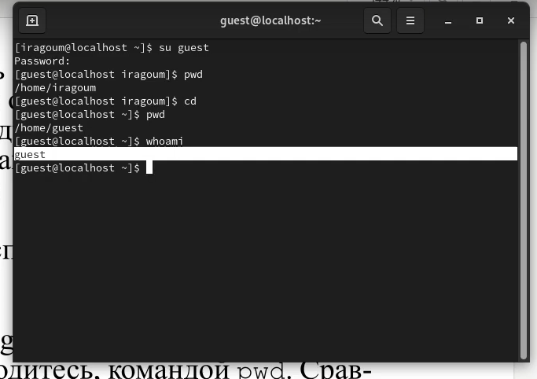{#fig:003 width=70%}

4. здесь мы указали имя нашего пользователя, его группу, а также группы, в которые входит пользователь, с помощью команды **id (@fig:004).

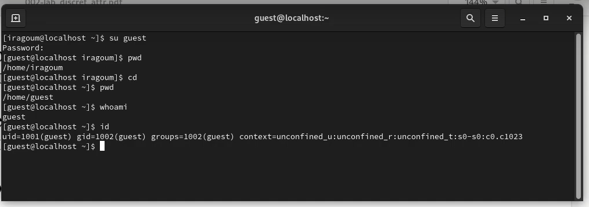{#fig:004 width=70%}

- мы обнаружили, что данные идентичны.

5. затем мы прочитали файл */etc/passwd*, используя команду cat, и после этого, используя команду **cat /etc/passwd | grep guest**, мы выделили все слова, содержащие слово guest, мы нашли те же данные, которые получили ранее (@fig:005).

{#fig:005 width=70%}

6. Затем мы определили существующие каталоги в системе с помощью команды **ls -l /home/** (@fig:006).

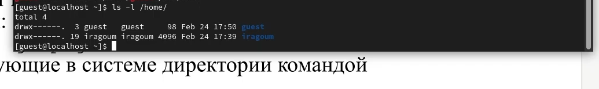{#fig:006 width=70%}

- да, мы смогли получить существующие подкаталоги каталога */home*, у них права **d(drwx)**

7. затем мы проверили, какие расширенные атрибуты установлены в подкаталогах, расположенных в каталоге /home, с помощью команды: **lsattr /home** и обнаружили, что у них нет расширенных атрибутов (@fig:007).

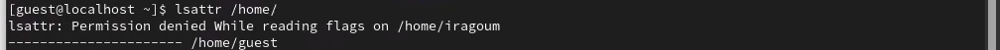{#fig:007 width=100%}

8. здесь мы создали каталог dir1, используя команду **mkdir** (@fig:008).

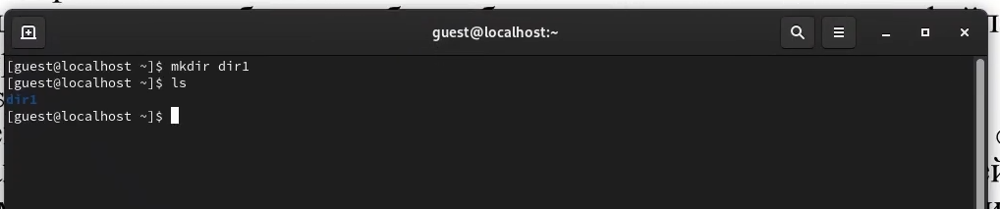{#fig:008 width=70%}

9. Используя команды **ls -l** и **lsattr**, мы определили, какие права доступа и расширенные атрибуты были установлены для каталога *dir1* (@fig:009).

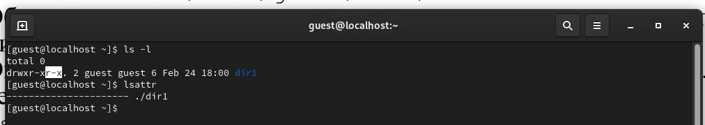{#fig:009 width=100%}

10. затем мы удалили все атрибуты из каталога *dir1* командой **chmod 000 dir1** (@fig:010).

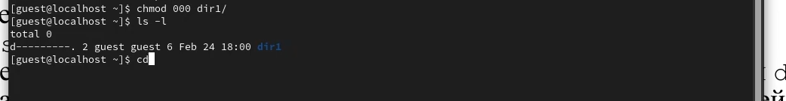{#fig:010 width=100%}

11. здесь мы попытались создать файл file 1 в каталоге dir1 с помощью команды **echo "test" > /home/guest/dir1/file1** , но у нас не было разрешения на это, потому что у нас нет прав в каталог *dir1* (@fig:011).

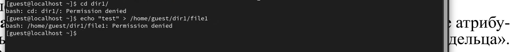{#fig:011 width=100%}

- нет, *file1* не находится внутри каталога *dir1*, потому что он даже не был создан.

12. здесь мы приступили к заполнению таблицы "Установленные права и разрешенные действия" (см. таблицу 2.1), выполняя действия от имени владельца каталога.

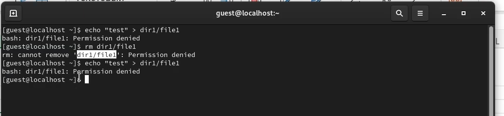{width=70%}

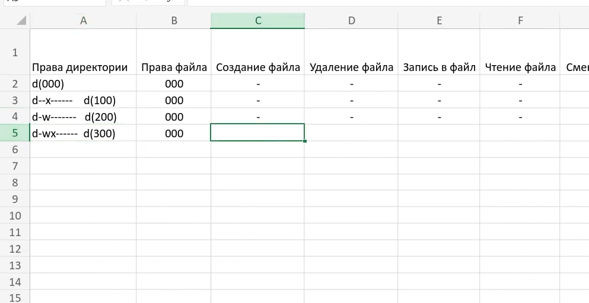{width=70%}

13. основываясь на заполненной таблице, мы смогли определить определенные минимально необходимые права для выполнения операций внутри каталога dir1, заполнив таблицу 2.2. (@fig:012)

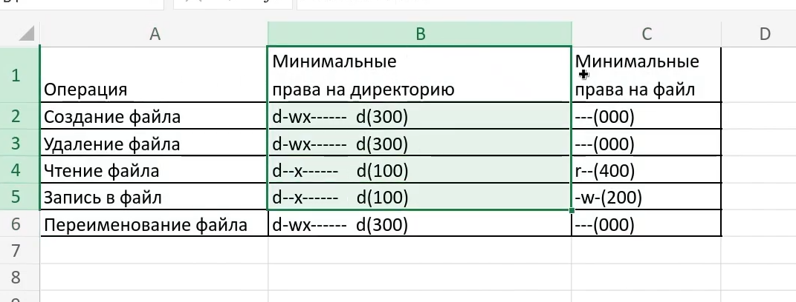{#fig:012 width=70%}

## выводы по результатам выполнения заданий:

- В рамках данной лабораторной работы мы получили практические навыки работы с атрибутами файлов в консоли Linux, а также закрепили теоретические основы дискреционного разграничения доступа.
  
# Выводы, согласованные с целью работы:

- В рамках данной лабораторной работы мы получили практические навыки работы с атрибутами файлов в консоли Linux, а также закрепили теоретические основы дискреционного разграничения доступа.
