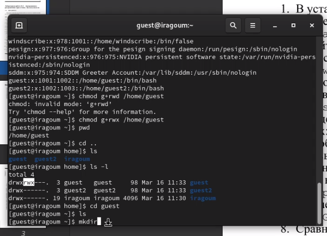

---
## Front matter
lang: ru-RU
title: Основы информационной безопасности 
subtitle: Лабораторная работа № 3. Дискреционное разграничение прав в Linux. Два пользователя
author:
  - Абдеррахим Мугари.
institute:
  - Российский университет дружбы народов, Москва, Россия
  
date: 16 марта 2024г

## i18n babel
babel-lang: russian
babel-otherlangs: english

## Formatting pdf
toc: false
toc-title: Содержание
slide_level: 2
aspectratio: 169
section-titles: true
theme: metropolis
header-includes:
 - \metroset{progressbar=frametitle,sectionpage=progressbar,numbering=fraction}
 - '\makeatletter'
 - '\beamer@ignorenonframefalse'
 - '\makeatother'
 
---

# Информация

## Докладчик

:::::::::::::: {.columns align=center}
::: {.column width="70%"}

  * Абдеррахим Мугари
  * Студент
  * Российский университет дружбы народов
  * [1032215692@pfur.ru](mailto:1032215692@pfur.ru)
  * <https://github.com/iragoum>

:::
::: {.column width="30%"}

:::
::::::::::::::

## Цель работы:

- Получение практических навыков работы в консоли с атрибутами файлов для групп пользователей.

## Материалы и методы

- Терминал Unix

# Ход работы: 

## создание учетных записей пользователей

- Первое, что мы сделали, это создали гостевую учетную запись пользователя (используя учетную запись администратора), используя команду **useradd guest**  после этого мы устанавливаем пароль для гостевого пользователя с помощью команды **passwd guest** после этого мы повторяем тот же процесс для второго пользователя **guest2**.

{width=50%}

## добавление guest2 в группу guest

- Затем мы добавили **guest2** в гостевую группу, используя команду: **gpasswd -a guest2 guest**.

{width=70%}

## доступ к обеим учетным записям пользователей с двух разных консолей

- Затем мы вошли в систему от двух пользователей на двух разных консолях: **guest** на первой консоли и **guest2** на второй консоли. После этого с помощью команды **pwd** мы нашли путь, по которому мы находились, который был домашним каталогом администратора.

{width=45%}

{width=90%}

- Здесь, используя команду **whoami**, мы могли бы определить имя нашего пользователя, а используя команды **group guest** и **group guest2**, мы могли бы определить группу, кто в ней находится и к каким группам он принадлежит. а затем мы сравнили выходные данные команды **group** с выводами команд **id -Gn** и **id -G** и содержимым /etc/group, и они оказались одинаковыми.

## определение того, к каким группам принадлежит каждый пользователь

{width=70%}

- От имени пользователя **guest2** мы зарегистрировали пользователя **guest2** в гостевой группе с помощью команды **newgrp guest**.

## регистрация пользователя guest2 в гостевой группе

{width=70%}

- От имени пользователя guest мы изменили разрешения каталога */home/guest*, разрешив все действия для пользователей группы с помощью команды: **chmod g+rwx /home/guest**.

## изменение разрешений для каталога */home/guest*, чтобы разрешить все действия для пользователей группы

{width=40%}

## изменение права доступа к каталогу dir1

- после создания каталога dir1 мы изменили право доступа к нему на 000, используя команду: **chmod 000 /home/guest/dir1/**

{width=40%}

## заполнение таблицы прав доступа

- как и во втором круге работы, мы начали заполнять таблицу прав доступа, изменив атрибуты каталога **dir1** и **file1** от имени пользователя **guest** и выполнив проверку от имени пользователя **guest2** после заполнения мы заметили, что таблица такая же, как и первая, но единственное отличие заключается в последнем столбце **изменение прав доступа к файлу**

{width=40%}

## заполнение таблицы прав доступа

{width=25%}

## заполнение таблицы прав доступа

- после этого мы заполнили вторую таблицу, которая является сводкой большой таблицы, и в ней показано, каковы минимальные права доступа для внесения определенных изменений

{width=70%}

## выводы по результатам выполнения заданий:

- К концу лабораторной работы мы приобрели практические навыки работы в консоли с атрибутами файлов для групп пользователей
  
# Выводы, согласованные с целью работы:

- К концу лабораторной работы мы приобрели практические навыки работы в консоли с атрибутами файлов для групп пользователей

