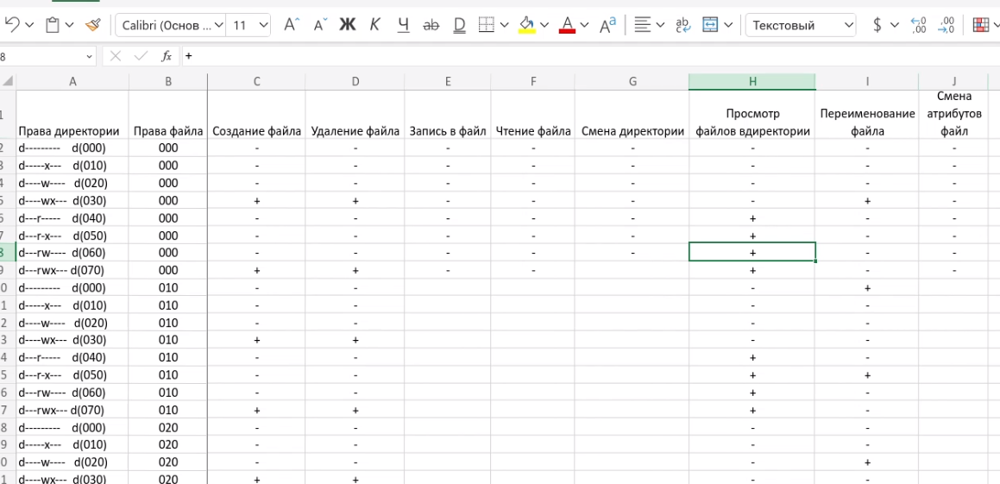

---
## Front matter
title: "Основы информационной безопасности"
subtitle: "Лабораторная работа № 3 | Дискреционное разграничение прав в Linux. Два пользователя"
author: "Мугари Абдеррахим - НКАбд-03-22"

## Generic otions
lang: ru-RU
toc-title: "Содержание"

## Bibliography
bibliography: bib/cite.bib
csl: pandoc/csl/gost-r-7-0-5-2008-numeric.csl

## Pdf output format
toc: true # Table of contents
toc-depth: 2
lof: true # List of figures
lot: true # List of tables
fontsize: 12pt
linestretch: 1.5
papersize: a4
documentclass: scrreprt
## I18n polyglossia
polyglossia-lang:
  name: russian
  options:
	- spelling=modern
	- babelshorthands=true
polyglossia-otherlangs:
  name: english
## I18n babel
babel-lang: russian
babel-otherlangs: english
## Fonts
mainfont: PT Serif
romanfont: PT Serif
sansfont: PT Sans
monofont: PT Mono
mainfontoptions: Ligatures=TeX
romanfontoptions: Ligatures=TeX
sansfontoptions: Ligatures=TeX,Scale=MatchLowercase
monofontoptions: Scale=MatchLowercase,Scale=0.9
## Biblatex
biblatex: true
biblio-style: "gost-numeric"
biblatexoptions:
  - parentracker=true
  - backend=biber
  - hyperref=auto
  - language=auto
  - autolang=other*
  - citestyle=gost-numeric
## Pandoc-crossref LaTeX customization
figureTitle: "Рис."
tableTitle: "Таблица"
listingTitle: "Листинг"
lofTitle: "Список иллюстраций"
lotTitle: "Список таблиц"
lolTitle: "Листинги"
## Misc options
indent: true
header-includes:
  - \usepackage{indentfirst}
  - \usepackage{float} # keep figures where there are in the text
  - \floatplacement{figure}{H} # keep figures where there are in the text
---

# Цель работы

- Получение практических навыков работы в консоли с атрибутами файлов для групп пользователей.

# Выполнение лабораторной работы

1. Первое, что мы сделали, это создали гостевую учетную запись пользователя (используя учетную запись администратора), используя команду **useradd guest**  после этого мы устанавливаем пароль для гостевого пользователя с помощью команды **passwd guest** после этого мы повторяем тот же процесс для второго пользователя **guest2** (рис. @fig:001).

{#fig:001 width=70%}

2. Затем мы добавили **guest2** в гостевую группу, используя команду: **gpasswd -a guest2 guest** (рис. @fig:002).

{#fig:002 width=70%}

3. Затем мы вошли в систему от двух пользователей на двух разных консолях: **guest** на первой консоли и **guest2** на второй консоли. После этого с помощью команды **pwd** мы нашли путь, по которому мы находились, который был домашним каталогом администратора (рис. @fig:003) (рис. @fig:004).

{#fig:003 width=70%}

{#fig:003 width=90%}

4. Здесь, используя команду **whoami**, мы могли бы определить имя нашего пользователя, а используя команды **group guest** и **group guest2**, мы могли бы определить группу, кто в ней находится и к каким группам он принадлежит. а затем мы сравнили выходные данные команды **group** с выводами команд **id -Gn** и **id -G** и содержимым /etc/group, и они оказались одинаковыми (рис. @fig:005).

{#fig:005 width=70%}

5. От имени пользователя **guest2** мы зарегистрировали пользователя **guest2** в гостевой группе с помощью команды **newgrp guest**  (рис. @fig:006).

{#fig:006 width=70%}

6. От имени пользователя guest мы изменили разрешения каталога */home/guest*, разрешив все действия для пользователей группы с помощью команды: **chmod g+rwx /home/guest** (рис. @fig:007).

{#fig:007 width=70%}

7. после создания каталога dir1 мы изменили право доступа к нему на 000, используя команду: **chmod 000 /home/guest/dir1/** (рис. @fig:008)

{#fig:008 width=70%}

8. как и во втором круге работы, мы начали заполнять таблицу прав доступа, изменив атрибуты каталога **dir1** и **file1** от имени пользователя **guest** и выполнив проверку от имени пользователя **guest2** после заполнения мы заметили, что таблица такая же, как и первая, но единственное отличие заключается в последнем столбце **изменение прав доступа к файлу** (рис. @fig:009), (рис. @fig:010)

{#fig:009 width=70%}

{#fig:010 width=70%}

9. после этого мы заполнили вторую таблицу, которая является сводкой большой таблицы, и в ней показано, каковы минимальные права доступа для внесения определенных изменений (рис. @fig:011)

{#fig:011 width=70%}

## выводы по результатам выполнения заданий:

- К концу лабораторной работы мы приобрели практические навыки работы в консоли с атрибутами файлов для групп пользователей
  
# Выводы, согласованные с целью работы:

- К концу лабораторной работы мы приобрели практические навыки работы в консоли с атрибутами файлов для групп пользователей

