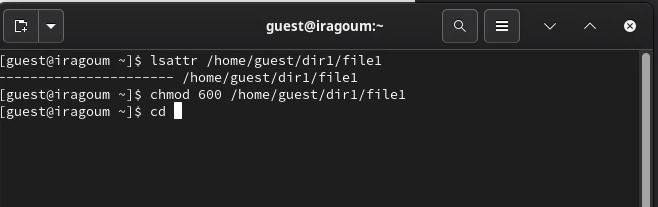
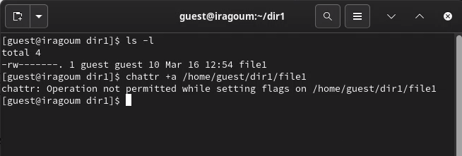
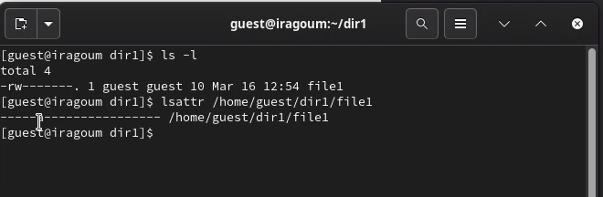
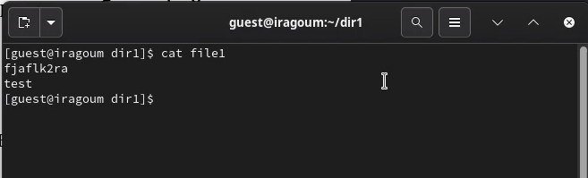
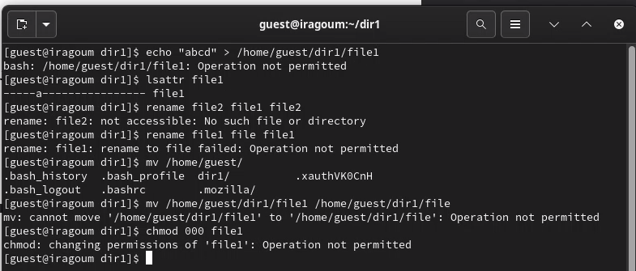
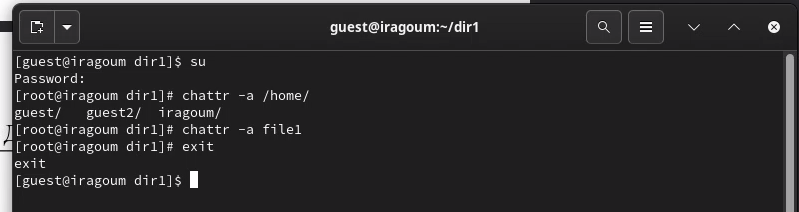
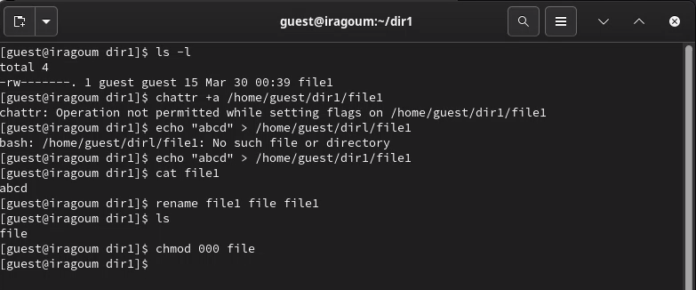
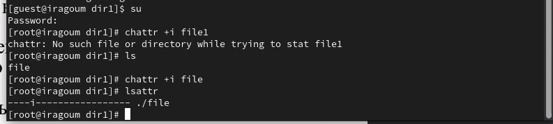
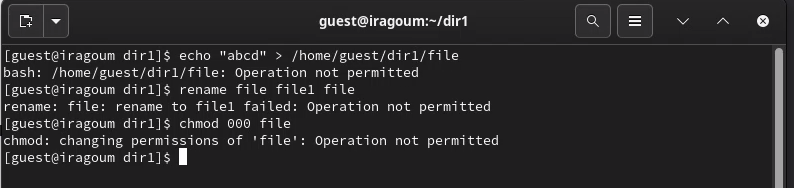

---
## Front matter
lang: ru-RU
title: Основы информационной безопасности 
subtitle: Лабораторная работа № 4. Дискреционное разграничение прав в Linux. Расширенные атрибуты
author:
  - Абдеррахим Мугари.
institute:
  - Российский университет дружбы народов, Москва, Россия
  
date: 30 марта 2024г

## i18n babel
babel-lang: russian
babel-otherlangs: english

## Formatting pdf
toc: false
toc-title: Содержание
slide_level: 2
aspectratio: 169
section-titles: true
theme: metropolis
header-includes:
 - \metroset{progressbar=frametitle,sectionpage=progressbar,numbering=fraction}
 - '\makeatletter'
 - '\beamer@ignorenonframefalse'
 - '\makeatother'
 
---

# Информация
## Докладчик

:::::::::::::: {.columns align=center}
::: {.column width="70%"}

  * Абдеррахим Мугари
  * Студент
  * Российский университет дружбы народов
  * [1032215692@pfur.ru](mailto:1032215692@pfur.ru)
  * <https://github.com/iragoum>

:::
::: {.column width="30%"}

:::
::::::::::::::

## Цель работы:

- 

## Материалы и методы

- Терминал Unix

# Ход работы: 
## определение расширенных атрибутов и предоставление файлу прав на чтение и запись

- От имени гостевого пользователя мы определили расширенные атрибуты файла ***/home/guest/dir1/file1*** с помощью команды **lsattr /home/guest/dir1/file1**, а затем с помощью команды **chmod 600 file1** мы устанавливаем права на чтение и запись для владельца файла в файле file1

{#fig:001 width=70%}

## попытка присвоить файлу расширенный атрибут без прав суперпользователя

- после этого мы пытаемся установить расширенный атрибут **a** от имени пользователя guest в файл */home/guest/dir1/file1*, используя команду **chattr +a /home/guest/dir1/file1**, но операция была прервана, поскольку она должна выполняться с суперпользователем привилегии

{#fig:002 width=70%}

## добавление расширенного атрибута в файл

- после этого с помощью команды **su** мы получили доступ к суперпользователю и добавили расширенный атрибут, и мы проверили это с помощью команды **lsattr /home/guest/dir1/file1**.

{#fig:003 width=70%}

## добавление информации в файл с расширенным атрибутом a

- после этого мы добавили слово "test" в файл file1 с помощью команды **echo "test" >> /home/guest/dir1/file1**, а затем мы проверили, было ли добавлено слово, прочитав файл с помощью команды **cat file1**

{#fig:004 width=70%}

## попытка выполнить некоторые операции с файлом с расширенным атрибутом

- на этом шаге мы попытались стереть содержащуюся в нем информацию с помощью команды **echo "abcd" > /home/guest/dir/file1**, что было запрещено из-за расширенного атрибута, затем мы попытались переименовать файл и даже удалить его права, но все это было запрещено , все благодаря расширенному атрибуту **a**

{#fig:005 width=70%}

- затем мы удалили расширенный атрибут a из файла /home/guest/dir/file1 от имени суперпользователя командой **chattr -a /home/guest/dir1/file1** и после повторения операций, которые были отклонены, все они были выполнены
## удаление расширенного атрибута из файла и повторное выполнение команды, которые не были разрешены

{#fig:006 width=70%}

## удаление расширенного атрибута из файла и повторное выполнение команды, которые не были разрешены

{#fig:007 width=70%}

## добавление атрибута i и повторение предыдущих команд

- и, наконец, мы повторили шаги, заменив атрибут "a" атрибутом "i". и переделал операцию в файле, и в этом случае все они были запрещены, потому что i (неизменяемый): Когда атрибут i установлен для файла, он делает файл неизменяемым, что означает, что его содержимое нельзя изменить, удалить, переименовать или связать с ним. Даже суперпользователь (root) не может изменить или удалить файл, пока не будет удален атрибут i. Этот атрибут обычно используется для критически важных системных файлов для предотвращения случайных или несанкционированных изменений

{#fig:008 width=70%}

## добавление атрибута i и повторение предыдущих команд

{#fig:009 width=70%}

## выводы по результатам выполнения заданий:

- К концу лабораторной работы мы приобрели практические навыки работы в консоли с атрибутами файлов для различных групп пользователей, понимая, как:

   1. Ограничивать доступ к файлам с помощью установки расширенных атрибутов.
   2. Работать с различными уровнями привилегий пользователей, включая суперпользователя.
   3. Проверять установку атрибутов и их воздействие на файлы.
   4. Использовать атрибуты a и i для защиты файлов от изменений и удаления.
   5. Проводить тесты, чтобы убедиться в правильной установке атрибутов и их воздействии на файлы.

# Выводы, согласованные с целью работы:

- К концу лабораторной работы мы приобрели практические навыки работы в консоли с атрибутами файлов

