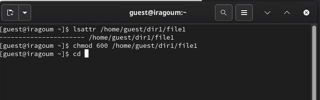
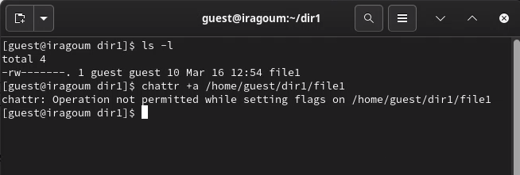
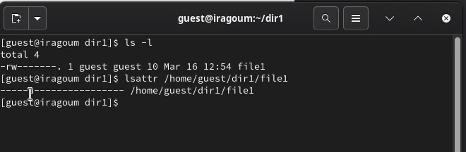
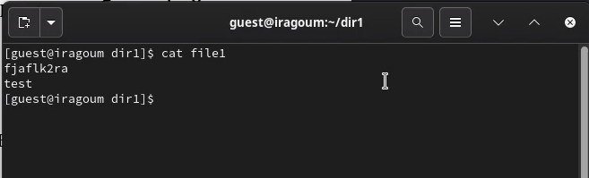
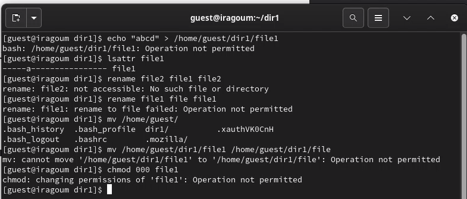
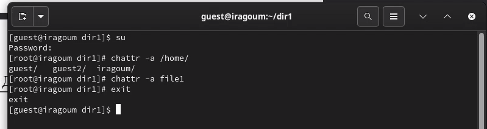
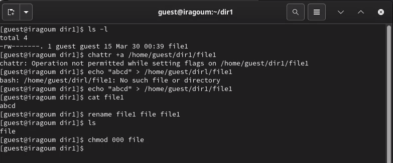
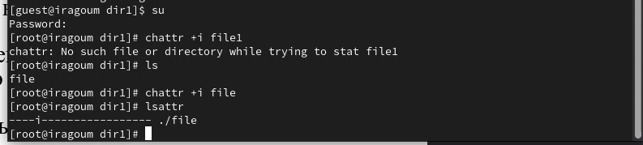
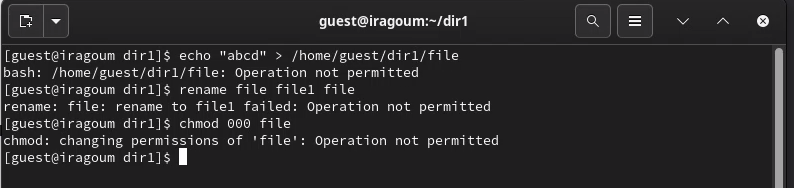

---
## Front matter
title: "Основы информационной безопасности"
subtitle: "Лабораторная работа № 4 | Дискреционное разграничение прав в Linux. Расширенные атрибуты"
author: "Мугари Абдеррахим - НКАбд-03-22"

## Generic otions
lang: ru-RU
toc-title: "Содержание"

## Bibliography
bibliography: bib/cite.bib
csl: pandoc/csl/gost-r-7-0-5-2008-numeric.csl

## Pdf output format
toc: true # Table of contents
toc-depth: 2
lof: true # List of figures
lot: true # List of tables
fontsize: 12pt
linestretch: 1.5
papersize: a4
documentclass: scrreprt
## I18n polyglossia
polyglossia-lang:
  name: russian
  options:
	- spelling=modern
	- babelshorthands=true
polyglossia-otherlangs:
  name: english
## I18n babel
babel-lang: russian
babel-otherlangs: english
## Fonts
mainfont: PT Serif
romanfont: PT Serif
sansfont: PT Sans
monofont: PT Mono
mainfontoptions: Ligatures=TeX
romanfontoptions: Ligatures=TeX
sansfontoptions: Ligatures=TeX,Scale=MatchLowercase
monofontoptions: Scale=MatchLowercase,Scale=0.9
## Biblatex
biblatex: true
biblio-style: "gost-numeric"
biblatexoptions:
  - parentracker=true
  - backend=biber
  - hyperref=auto
  - language=auto
  - autolang=other*
  - citestyle=gost-numeric
## Pandoc-crossref LaTeX customization
figureTitle: "Рис."
tableTitle: "Таблица"
listingTitle: "Листинг"
lofTitle: "Список иллюстраций"
lotTitle: "Список таблиц"
lolTitle: "Листинги"
## Misc options
indent: true
header-includes:
  - \usepackage{indentfirst}
  - \usepackage{float} # keep figures where there are in the text
  - \floatplacement{figure}{H} # keep figures where there are in the text
---

# Цель работы
- Получение практических навыков работы в консоли с расширенными атрибутами файлов

# Выполнение лабораторной работы

1. От имени гостевого пользователя мы определили расширенные атрибуты файла ***/home/guest/dir1/file1*** с помощью команды **lsattr /home/guest/dir1/file1**, а затем с помощью команды **chmod 600 file1** мы устанавливаем права на чтение и запись для владельца файла в файле file1 (рис. @fig:001).

{#fig:001 width=70%}

2. после этого мы пытаемся установить расширенный атрибут **a** от имени пользователя guest в файл */home/guest/dir1/file1*, используя команду **chattr +a /home/guest/dir1/file1**, но операция была прервана, поскольку она должна выполняться с суперпользователем привилегии (рис. @fig:002).

{#fig:002 width=70%}

3. после этого с помощью команды **su** мы получили доступ к суперпользователю и добавили расширенный атрибут, и мы проверили это с помощью команды **lsattr /home/guest/dir1/file1** (рис. @fig:003).

{#fig:003 width=70%}

4. после этого мы добавили слово "test" в файл file1 с помощью команды **echo "test" >> /home/guest/dir1/file1**, а затем мы проверили, было ли добавлено слово, прочитав файл с помощью команды **cat file1** (рис. @fig:004).

{#fig:004 width=70%}

5. на этом шаге мы попытались стереть содержащуюся в нем информацию с помощью команды **echo "abcd" > /home/guest/dir/file1**, что было запрещено из-за расширенного атрибута, затем мы попытались переименовать файл и даже удалить его права, но все это было запрещено , все благодаря расширенному атрибуту **a** (рис. @fig:005).

{#fig:005 width=70%}

6. затем мы удалили расширенный атрибут a из файла /home/guest/dir/file1 от имени суперпользователя командой **chattr -a /home/guest/dir1/file1** и после повторения операций, которые были отклонены, все они были выполнены (рис. @fig:006) (рис. @fig:006) (рис. @fig:007).

{#fig:006 width=70%}

{#fig:007 width=70%}

7. и, наконец, мы повторили шаги, заменив атрибут "a" атрибутом "i". и переделал операцию в файле, и в этом случае все они были запрещены, потому что i (неизменяемый): Когда атрибут i установлен для файла, он делает файл неизменяемым, что означает, что его содержимое нельзя изменить, удалить, переименовать или связать с ним. Даже суперпользователь (root) не может изменить или удалить файл, пока не будет удален атрибут i. Этот атрибут обычно используется для критически важных системных файлов для предотвращения случайных или несанкционированных изменений (рис. @fig:008). 

{#fig:008 width=70%}

{#fig:009 width=70%}

## выводы по результатам выполнения заданий:

- К концу лабораторной работы мы приобрели практические навыки работы в консоли с атрибутами файлов для различных групп пользователей, понимая, как:

   1. Ограничивать доступ к файлам с помощью установки расширенных атрибутов.
   2. Работать с различными уровнями привилегий пользователей, включая суперпользователя.
   3. Проверять установку атрибутов и их воздействие на файлы.
   4. Использовать атрибуты a и i для защиты файлов от изменений и удаления.
   5. Проводить тесты, чтобы убедиться в правильной установке атрибутов и их воздействии на файлы.

# Выводы, согласованные с целью работы:

- К концу лабораторной работы мы приобрели практические навыки работы в консоли с атрибутами файлов

