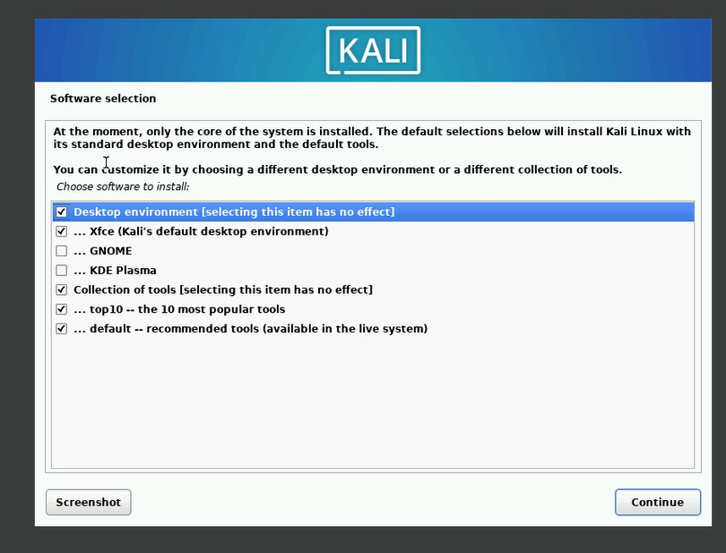

---
## Front matter
lang: ru-RU
title: Основы информационной безопасности 
subtitle: Индивидуальный проект | Этап 1 | Установка Kali Linux в виртуальную машину
author:
  - Абдеррахим Мугари.
institute:
  - Российский университет дружбы народов, Москва, Россия
  
date: 02 марта 2024г

## i18n babel
babel-lang: russian
babel-otherlangs: english

## Formatting pdf
toc: false
toc-title: Содержание
slide_level: 2
aspectratio: 169
section-titles: true
theme: metropolis
header-includes:
 - \metroset{progressbar=frametitle,sectionpage=progressbar,numbering=fraction}
 - '\makeatletter'
 - '\beamer@ignorenonframefalse'
 - '\makeatother'
 
---

# Информация

## Докладчик

:::::::::::::: {.columns align=center}
::: {.column width="70%"}

  * Абдеррахим Мугари
  * Студент
  * Российский университет дружбы народов
  * [1032215692@pfur.ru](mailto:1032215692@pfur.ru)
  * <https://github.com/iragoum>

:::
::: {.column width="30%"}

:::
::::::::::::::

## Цель работы:

- Целью данной работы является приобретение практических навыков установки операционной системы на виртуальную машину, настройки минимально необходимых для дальнейшей работы сервисов.

## Материалы и методы

- Virtualbox.
- Образ диска Kali linux Amd64.

# Ход работы: 

## создание виртуальной машины

- После загрузки необходимого образа *kali linux* и установки *virtualbox* пришло время установить *kali linux* на нашу виртуальную машину, для этого нам нужно было создать новую виртуальную машину, и мы дали ей имя **Kali linux**, после этого мы выбрали наш образ в формате **.iso**

{width=40%}

## распределение оперативной памяти и ядер

- затем нам нужно было выделить, сколько оперативной памяти и процессорных ядер мы хотим выделить нашей виртуальной машине. В нашем случае мы выделили ***6 ГБ*** оперативной памяти и ***6 ядер***

{width=40%}

## настройка видеопамяти

- после этого мы снова открыли настройки виртуальной машины и увеличили объем видеопамяти до ***128 МБ***

{width=50%}

## запуск установки

- после этого мы запустили виртуальную машину и загрузились с live cd, на котором выбрали графический установщик

{width=50%}

## конфигурация имени хоста

- сначала нам нужно было настроить имя хоста.

{width=50%}

## настройка имени пользователя

- после этого мы настраиваем имя пользователя для нашей учетной записи

{width=50%}

## настройка пароля для пользователя

Здесь мы установили нашему пользователю парол.

{width=50%}

## разбиение диска на разделы

- затем мы подошли к шагу, на котором нам нужно было разбить наши диски на разделы, и мы выбрали первый вариант, чтобы весь диск мог быть полностью и автоматически разбит на разделы.

{ width=40%}

## разбиение диска на разделы

{#fig:009 width=50%}

## выбор программного обеспечения

- На этом шаге мы выбрали программное обеспечение, которое мы хотим установить в нашу операционную систему, и одним из них является графический интерфейс

{#fig:010 width=50%}

## Установка GRUB

- после этого мы установили загрузчик grub на наш основной диск, потому что мы не использовали двойную загрузку на этом виртуальном диске, поэтому единственной операционной системой на нем была kali linux

{width=40%}

## Установка GRUB

- после этого нам нужно было выбрать диск, на который мы хотим установить ***grub***

{width=50%}

## установка гостевых дополнений virtualbox

- и, наконец, мы установили гостевые дополнения virtualbox, чтобы наша виртуальная машина могла работать в полном разрешении и активировать другие функции, такие как обмен файлами между хостом и гостевой машиной.

{width=45%}

## установка гостевых дополнений virtualbox

- и здесь вы можете увидеть рабочий стол нашей операционной системы после установки драйверов.

{#fig:014 width=70%}

# Выводы, согласованные с целью работы:

- В заключение лабораторной работы, мы успешно освоили установку операционной системы Kali Linux на виртуальную машину в программе Oracle VM VirtualBox. Этот опыт позволит нам эффективно использовать Kali Linux для задач кибербезопасности и тестирования на проникновение.
