---
## Front matter
title: "Основы информационной безопасности | Индивидуальный проект | Этап 1"
subtitle: "Установка Kali Linux в виртуальную машину"
author: "Мугари Абдеррахим"

## Generic otions
lang: ru-RU
toc-title: "Содержание"

## Bibliography
bibliography: bib/cite.bib
csl: pandoc/csl/gost-r-7-0-5-2008-numeric.csl

## Pdf output format
toc: true # Table of contents
toc-depth: 2
lof: true # List of figures
lot: true # List of tables
fontsize: 12pt
linestretch: 1.5
papersize: a4
documentclass: scrreprt
## I18n polyglossia
polyglossia-lang:
  name: russian
  options:
	- spelling=modern
	- babelshorthands=true
polyglossia-otherlangs:
  name: english
## I18n babel
babel-lang: russian
babel-otherlangs: english
## Fonts
mainfont: PT Serif
romanfont: PT Serif
sansfont: PT Sans
monofont: PT Mono
mainfontoptions: Ligatures=TeX
romanfontoptions: Ligatures=TeX
sansfontoptions: Ligatures=TeX,Scale=MatchLowercase
monofontoptions: Scale=MatchLowercase,Scale=0.9
## Biblatex
biblatex: true
biblio-style: "gost-numeric"
biblatexoptions:
  - parentracker=true
  - backend=biber
  - hyperref=auto
  - language=auto
  - autolang=other*
  - citestyle=gost-numeric
## Pandoc-crossref LaTeX customization
figureTitle: "Рис."
tableTitle: "Таблица"
listingTitle: "Листинг"
lofTitle: "Список иллюстраций"
lotTitle: "Список таблиц"
lolTitle: "Листинги"
## Misc options
indent: true
header-includes:
  - \usepackage{indentfirst}
  - \usepackage{float} # keep figures where there are in the text
  - \floatplacement{figure}{H} # keep figures where there are in the text
---

# Цель работы

- Целью данной работы является приобретение практических навыков установки операционной системы на виртуальную машину, настройки минимально необходимых для дальнейшей работы сервисов.

# Выполнение первого этапа индивидуального проекта 

1. После загрузки необходимого образа *kali linux* и установки *virtualbox* пришло время установить *kali linux* на нашу виртуальную машину, для этого нам нужно было создать новую виртуальную машину, и мы дали ей имя **Kali linux**, после этого мы выбрали наш образ в формате **.iso** (рис. [-@fig:001]).

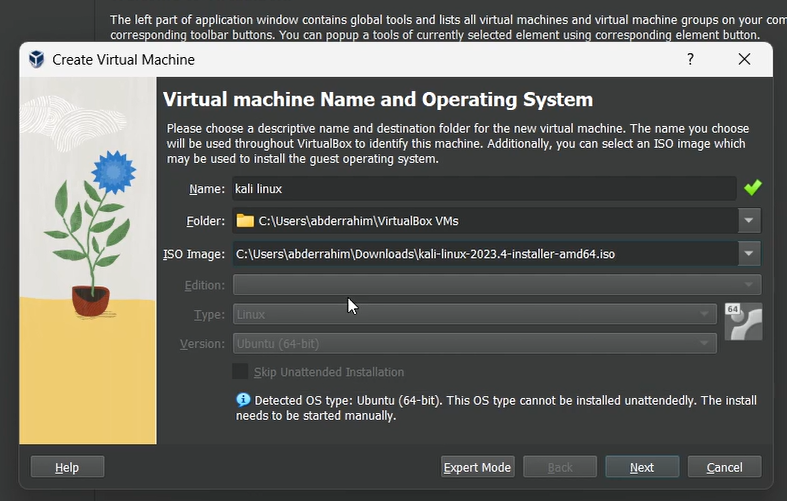{#fig:001 width=70%}

2. затем нам нужно было выделить, сколько оперативной памяти и процессорных ядер мы хотим выделить нашей виртуальной машине. В нашем случае мы выделили ***6 ГБ*** оперативной памяти и ***6 ядер*** (рис. [-@fig:002]).

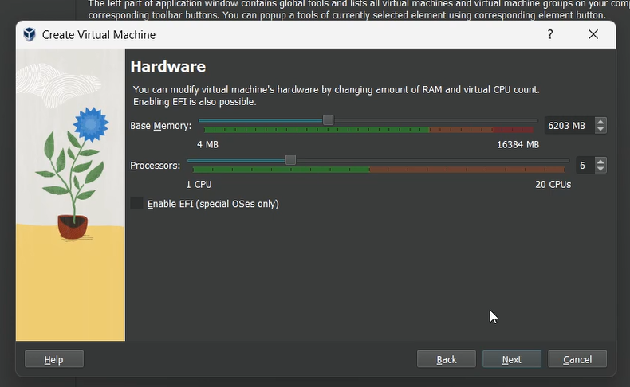{#fig:002 width=70%}

3. после этого мы снова открыли настройки виртуальной машины и увеличили объем видеопамяти до ***128 МБ*** (рис. [-@fig:003]).

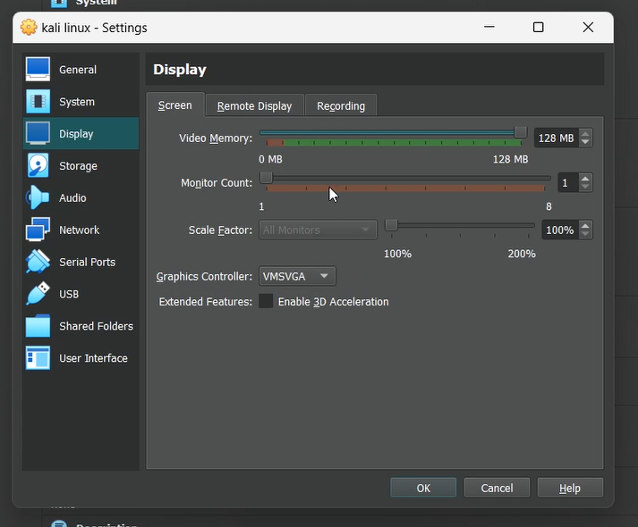{#fig:003 width=70%}

4. после этого мы запустили виртуальную машину и загрузились с live cd, на котором выбрали графический установщик (рис. [-@fig:004]).

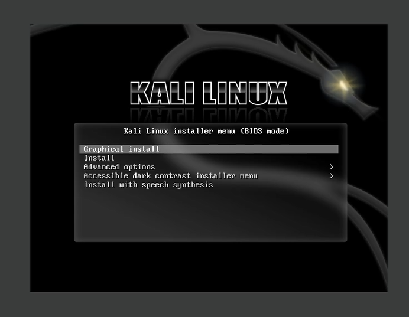{#fig:004 width=70%}

5. сначала нам нужно было настроить имя хоста (рис. [-@fig:005]).

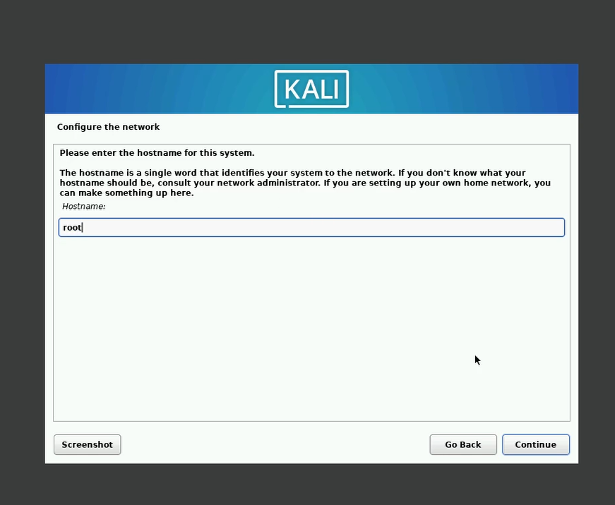{#fig:005 width=50%}

6. после этого мы настраиваем имя пользователя для нашей учетной записи (рис. [-@fig:006]).

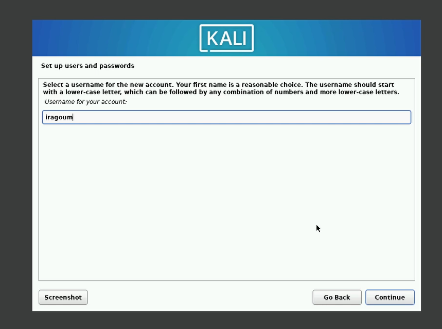{#fig:006 width=70%}

7. Здесь мы установили нашему пользователю пароль (рис. [-@fig:007]).

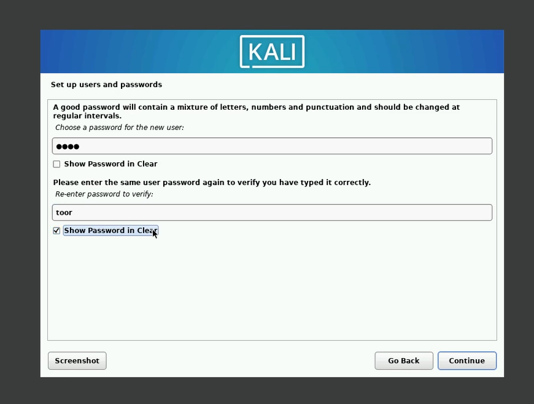{#fig:007 width=60%}

8. затем мы подошли к шагу, на котором нам нужно было разбить наши диски на разделы, и мы выбрали первый вариант, чтобы весь диск мог быть полностью и автоматически разбит на разделы (рис. [-@fig:008]) (рис. [-@fig:009]).

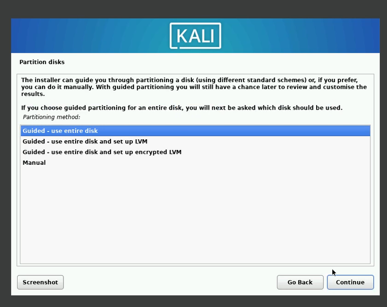{#fig:008 width=60%}

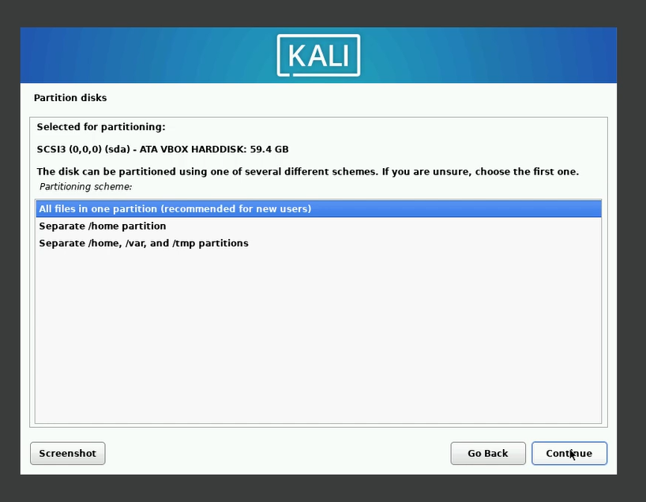{#fig:009 width=60%}

9. На этом шаге мы выбрали программное обеспечение, которое мы хотим установить в нашу операционную систему, и одним из них является графический интерфейс(рис. [-@fig:010]).

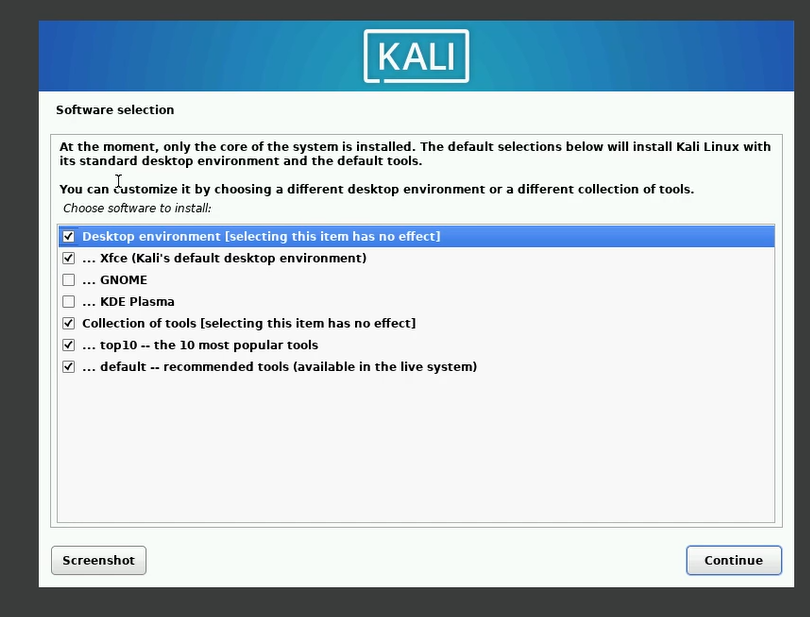{#fig:010 width=60%}

10. после этого мы установили загрузчик grub на наш основной диск, потому что мы не использовали двойную загрузку на этом виртуальном диске, поэтому единственной операционной системой на нем была kali linux (рис. [-@fig:011]).

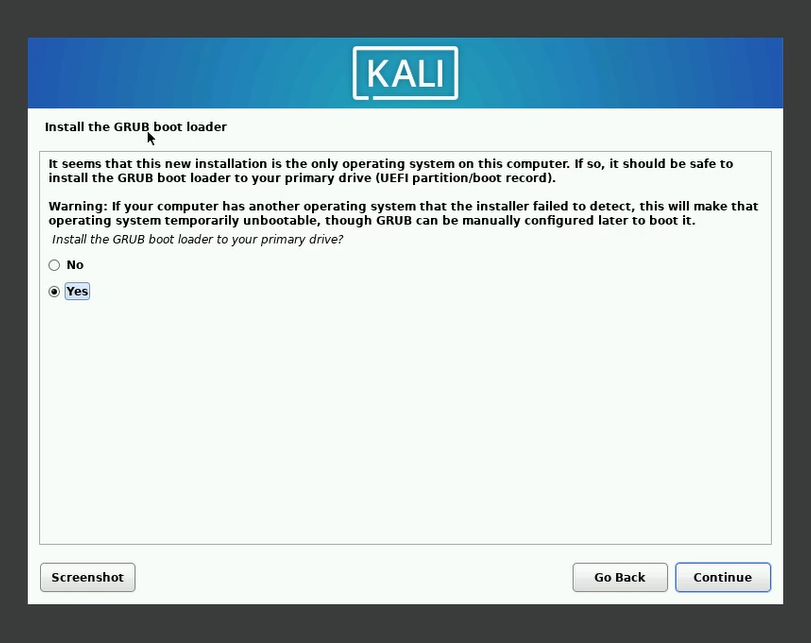{#fig:011 width=60%}

11. после этого нам нужно было выбрать диск, на который мы хотим установить ***grub*** (рис. [-@fig:012]).

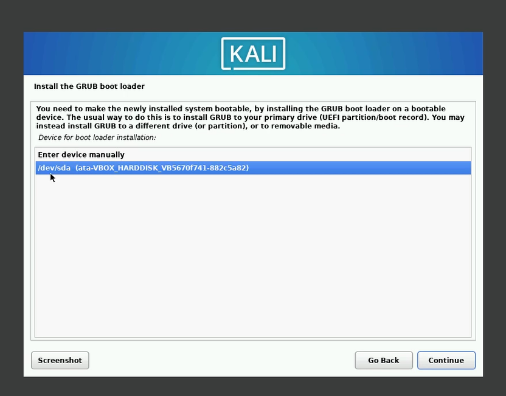{#fig:012 width=60%}

13. и, наконец, мы установили гостевые дополнения virtualbox, чтобы наша виртуальная машина могла работать в полном разрешении и активировать другие функции, такие как обмен файлами между хостом и гостевой машиной (рис. [-@fig:013]).

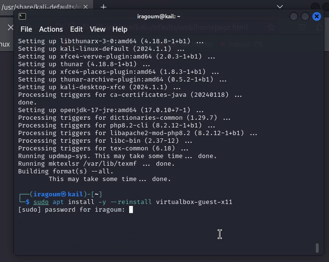{#fig:013 width=60%}

14. и здесь вы можете увидеть рабочий стол нашей операционной системы после установки драйверов (рис. [-@fig:014]).

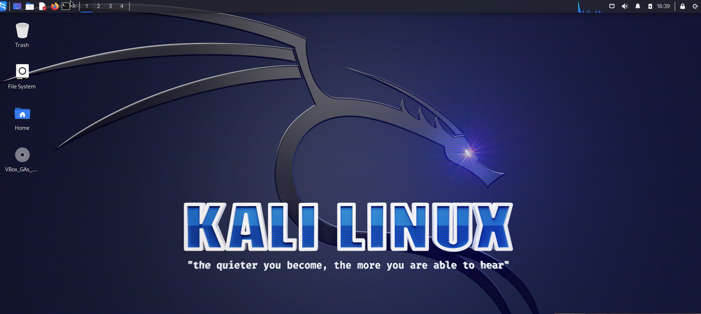{#fig:014 width=60%}

# Выводы

- В заключение лабораторной работы, мы успешно освоили установку операционной системы Kali Linux на виртуальную машину в программе Oracle VM VirtualBox. Этот опыт позволит нам эффективно использовать Kali Linux для задач кибербезопасности и тестирования на проникновение.

