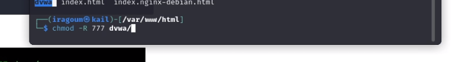

---
## Front matter
lang: ru-RU
title: Основы информационной безопасности 
subtitle: Индивидуальный проект | Этап 2 | Установка DVWA в гостевой системе для Kali Linux.
author:
  - Абдеррахим Мугари.
institute:
  - Российский университет дружбы народов, Москва, Россия
  
date: 16 марта 2024г

## i18n babel
babel-lang: russian
babel-otherlangs: english

## Formatting pdf
toc: false
toc-title: Содержание
slide_level: 2
aspectratio: 169
section-titles: true
theme: metropolis
header-includes:
 - \metroset{progressbar=frametitle,sectionpage=progressbar,numbering=fraction}
 - '\makeatletter'
 - '\beamer@ignorenonframefalse'
 - '\makeatother'
 
---

# Информация

## Докладчик

:::::::::::::: {.columns align=center}
::: {.column width="70%"}

  * Абдеррахим Мугари
  * Студент
  * Российский университет дружбы народов
  * [1032215692@pfur.ru](mailto:1032215692@pfur.ru)
  * <https://github.com/iragoum>

:::
::: {.column width="30%"}

:::
::::::::::::::

## Цель работы:

- установка DVWA в гостевой системе для Kali Linux.

## Материалы и методы

- Terminal Unix
- DVWA

# Ход работы: 

## переход в каталог /var/www/html для клонирования DVWA GitHub 

- Для начала нам нужно будет клонировать DVWA GitHub в наш каталог /var/www/html. Это расположение, где находятся файлы Localhost 
{width=50%}

## клонирование репозитория

-  здесь мы клонировали репозиторий в нашу систему 

{width=40%}

## переименование репозитория для упрощения работы

- После клонирования мы можем переименовать папку DVWA в dvwa. Это не обязательно, но упрощает работу при выполнении нескольких команд
 
{width=50%}

## изменение прав доступа к каталогу dvwa

-После загрузки клонирования DVWA в наш каталог /var/www/html нам все еще нужно выполнить некоторые незначительные настройки. Для начала давайте установим разрешения на чтение, запись и выполнение директору DVWA  

{width=50%}

## установка пароля и логина для входа в базу данных

- после этого мы перешли в **cd dvwa/config** скопировали файл, чтобы сделать для него резервную копию, и внутри копии изменили имя пользователя и пароль

{width=50%}

- здесь нам не нужно было устанавливать mysql, потому что он уже был установлен 

## настройка mysql

{ width=70%}

## войдите в базу данных и создайте нового пользователя

- здесь мы вошли в базу данных MySQL, используя приведенную ниже команду от имени root и создал нового пользователя 

{ width=40%}

## вход в базу данных из браузера

- и, наконец, используя адрес http://127.0.0.1/dvwa/, мы смогли подключиться к базе данных 

{ width=40%}

# Выводы, согласованные с целью работы:

- в этой лаборатории мы узнали, как установить и настроить DVWA, чтобы в будущем иметь возможность тестировать различные бреши в системе безопасности и устранять их

