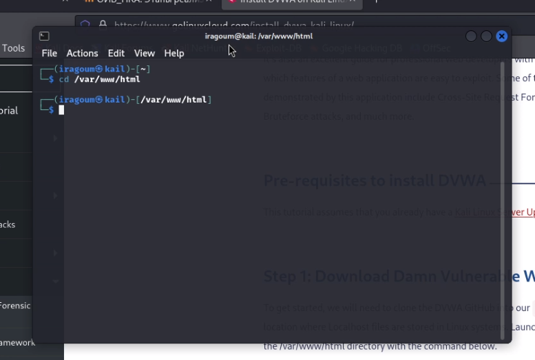
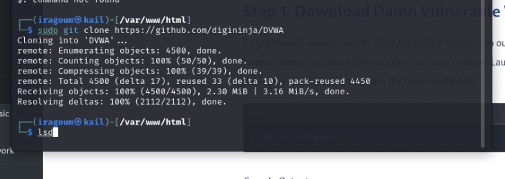
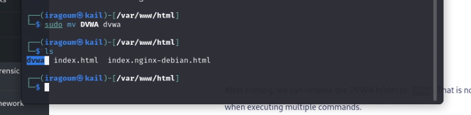
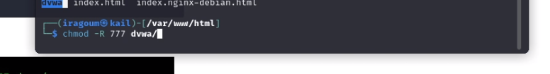
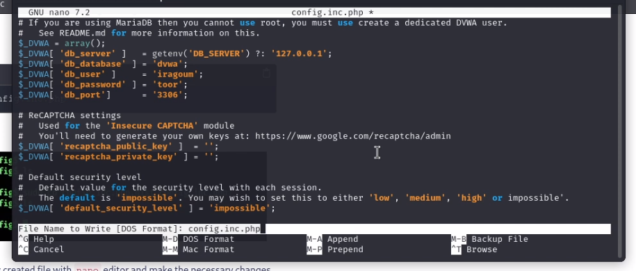
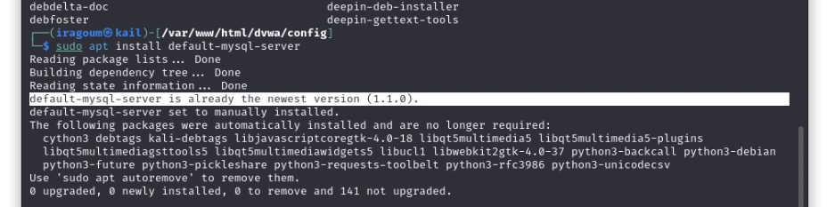
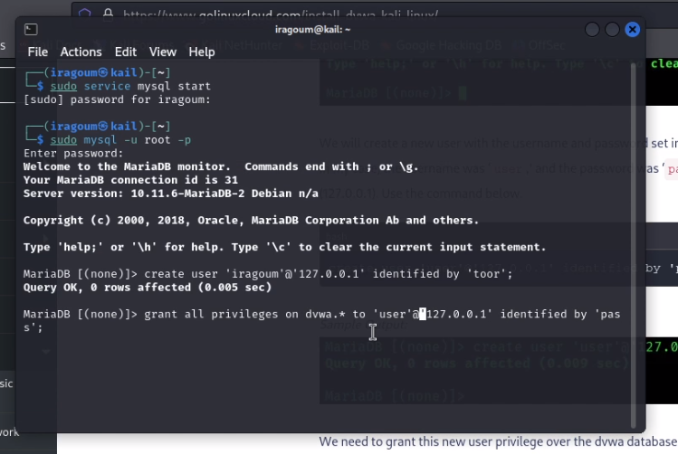
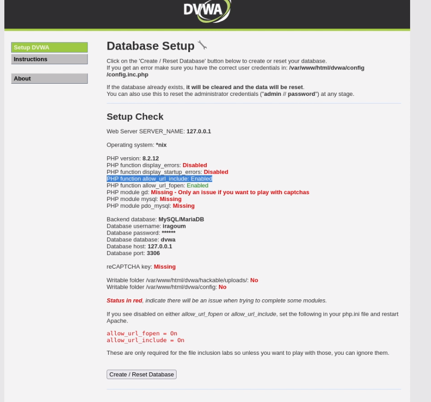

---
## Front matter
title: "Основы информационной безопасности | Индивидуальный проект | Этап 1"
subtitle: "Установка DVWA на kali linux"
author: "Мугари Абдеррахим"

## Generic otions
lang: ru-RU
toc-title: "Содержание"

## Bibliography
bibliography: bib/cite.bib
csl: pandoc/csl/gost-r-7-0-5-2008-numeric.csl

## Pdf output format
toc: true # Table of contents
toc-depth: 2
lof: true # List of figures
lot: true # List of tables
fontsize: 12pt
linestretch: 1.5
papersize: a4
documentclass: scrreprt
## I18n polyglossia
polyglossia-lang:
  name: russian
  options:
	- spelling=modern
	- babelshorthands=true
polyglossia-otherlangs:
  name: english
## I18n babel
babel-lang: russian
babel-otherlangs: english
## Fonts
mainfont: PT Serif
romanfont: PT Serif
sansfont: PT Sans
monofont: PT Mono
mainfontoptions: Ligatures=TeX
romanfontoptions: Ligatures=TeX
sansfontoptions: Ligatures=TeX,Scale=MatchLowercase
monofontoptions: Scale=MatchLowercase,Scale=0.9
## Biblatex
biblatex: true
biblio-style: "gost-numeric"
biblatexoptions:
  - parentracker=true
  - backend=biber
  - hyperref=auto
  - language=auto
  - autolang=other*
  - citestyle=gost-numeric
## Pandoc-crossref LaTeX customization
figureTitle: "Рис."
tableTitle: "Таблица"
listingTitle: "Листинг"
lofTitle: "Список иллюстраций"
lotTitle: "Список таблиц"
lolTitle: "Листинги"
## Misc options
indent: true
header-includes:
  - \usepackage{indentfirst}
  - \usepackage{float} # keep figures where there are in the text
  - \floatplacement{figure}{H} # keep figures where there are in the text
---

# Цель работы

- установка DVWA в гостевой системе для Kali Linux.

# Выполнение первого этапа индивидуального проекта 

1. Для начала нам нужно будет клонировать DVWA GitHub в наш каталог /var/www/html. Это расположение, где находятся файлы Localhost (рис. [-@fig:001]).

{#fig:001 width=70%}

2. здесь мы клонировали репозиторий в нашу систему (рис. [-@fig:002]).

{#fig:002 width=70%}

3. После клонирования мы можем переименовать папку DVWA в dvwa. Это не обязательно, но упрощает работу при выполнении нескольких команд (рис. [-@fig:003]).
 
{#fig:003 width=70%}

4. После загрузки клонирования DVWA в наш каталог /var/www/html нам все еще нужно выполнить некоторые незначительные настройки. Для начала давайте установим разрешения на чтение, запись и выполнение директору DVWA  (рис. [-@fig:004]).

{#fig:004 width=70%}

5. после этого мы перешли в **cd dvwa/config** скопировали файл, чтобы сделать для него резервную копию, и внутри копии изменили имя пользователя и пароль (рис. [-@fig:005]).

{#fig:005 width=70%}

6. здесь нам не нужно было устанавливать mysql, потому что он уже был установлен (рис. [-@fig:006])

{#fig:006 width=70%}

7. здесь мы вошли в базу данных MySQL, используя приведенную ниже команду от имени root и создал нового пользователя (рис. [-@fig:007])

{#fig:007 width=70%}

8. и, наконец, используя адрес http://127.0.0.1/dvwa/, мы смогли подключиться к базе данных (рис. [-@fig:008])

{#fig:008 width=70%}

# Выводы

- в этой лаборатории мы узнали, как установить и настроить DVWA, чтобы в будущем иметь возможность тестировать различные бреши в системе безопасности и устранять их

